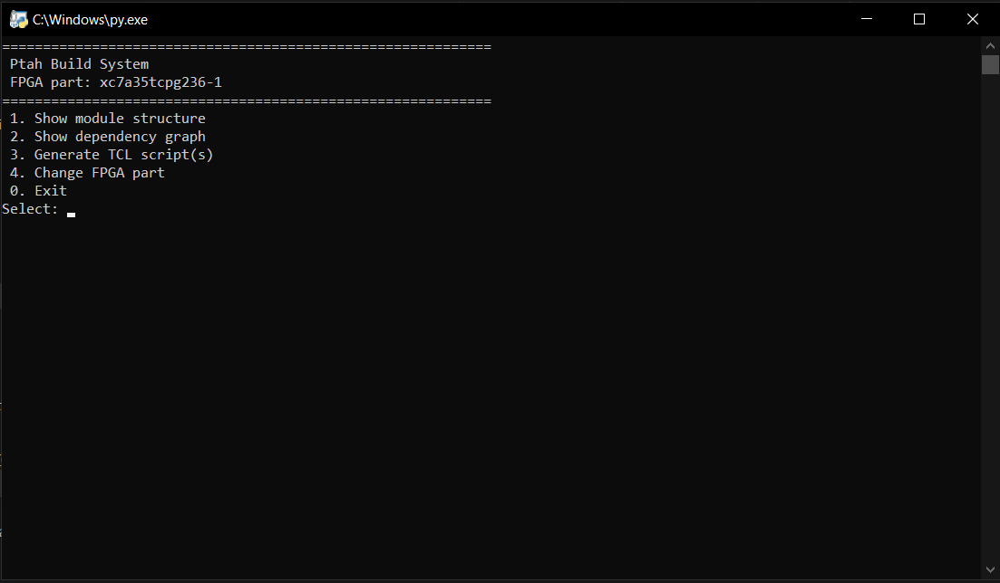
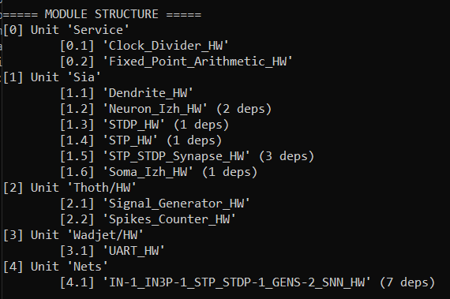
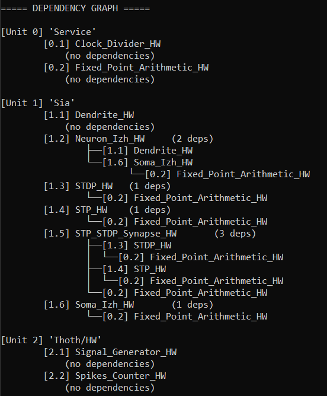
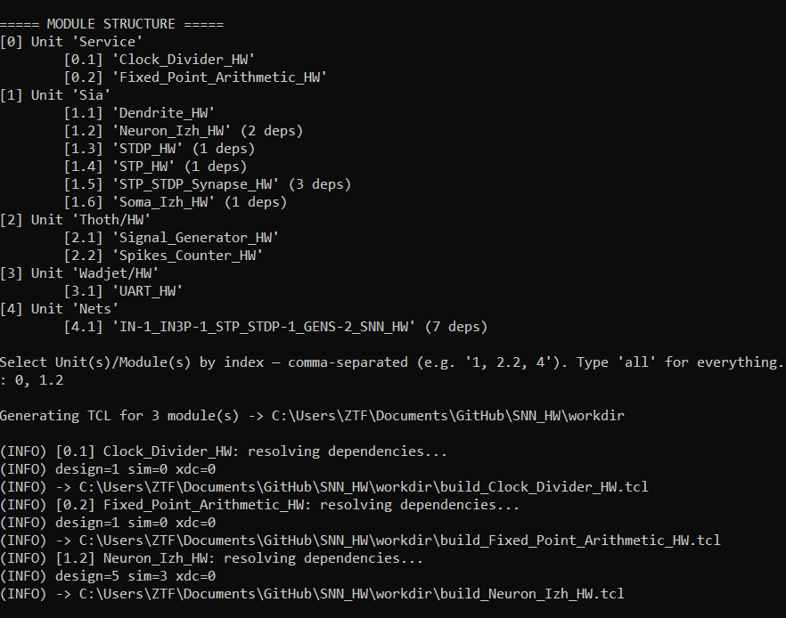
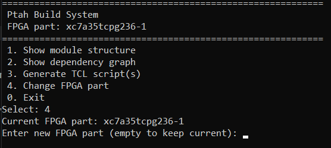
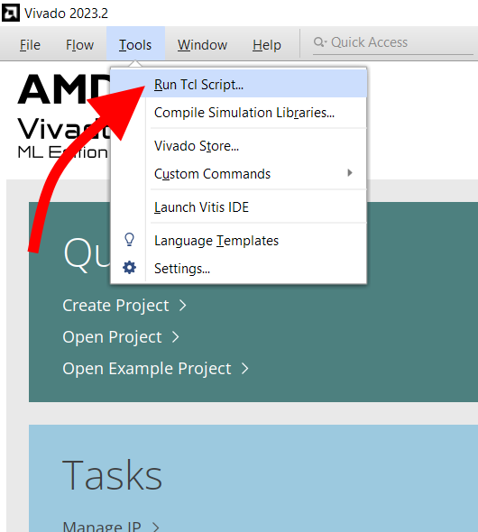
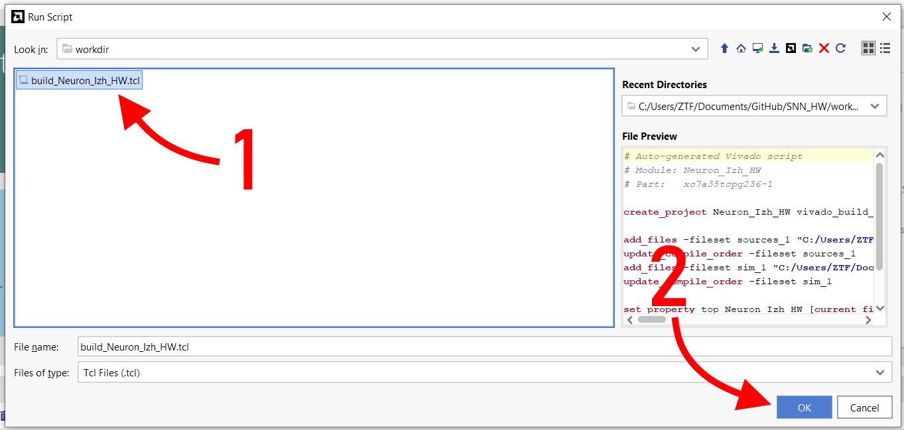
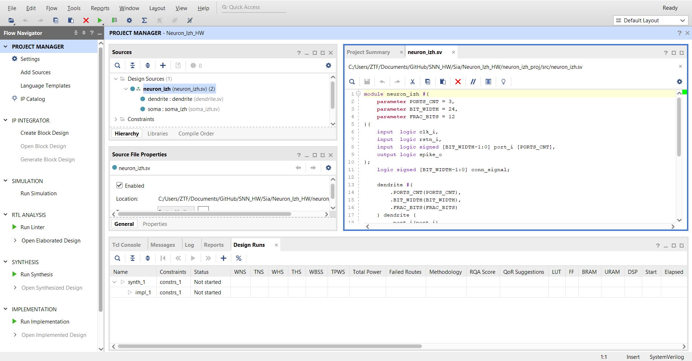

# Ptah Build System

## Ptah menu



### Module structure

Simply displays source files.



### Dependency graph

The dependency graph will show whether there are any cyclic dependencies or if any dependencies are missing.



### Generate .tcl script

Specify modules list to generate build `.tcl` scripts. If Unit ID is specified - scripts will be generated for all it's Modules.

The resulting `.tcl` script will be placed in the `<root>/workdir` directory.



### Change FPGA part

Specify any correct Xilinx FPGA part name.



## Run build_generated.tcl script in Vivado





### Enjoy



## Git commit changes

When working with the built project, any changes made to files are reflected in the source files from Git, so Git automatically detects these changes.

Add new files to the source directories if you want to commit them to Git.

## Notes

- If the Vivado project wasn't saved, you can find temp project copy in the `C:\Users\<user_name>\AppData\Roaming\Xilinx\Vivado` directory.

---

## Dependecies strucure

### Files structure
```
Nets
├── <net_config_name>_HW
│   ├── snn_proj
│   │   ├── constrs
│   │   │   └── <file_name>.xdc
│   │   ├── sim
│   │   │   └── snn_tb.sv
│   │   └── src
│   │       └── snn.sv
│   ├── metainfo.json
│   └── README.md
...
└── ...
----------------------------------------
<Unit_Name>
├── <Module_Name>_HW
│   ├── <module_name>_proj
│   │   ├── constrs
│   │   │   └── <file_name>.xdc
│   │   ├── sim
│   │   │   └── <module_name>_tb.sv
│   │   └── src
│   │       └── <module_name>.sv
│   ├── metainfo.json
│   └── README.md
...
└── ...
```

### metainfo.json file structure

``` json
{
    "unit": "<Unit_Name>",
    "module": "<Module_Name>",
    "dependencies":
    [
        "<Unit_Name>/<Module_Name>",
        ...
    ]
}
```

- If Unit has SW and HW parts, specify HW:
``` json
{
    "unit": "<Unit_Name>",
    "module": "<Module_Name>",
    "dependencies":
    [
        "<Unit_Name>/HW/<Module_Name>",
        ...
    ]
}
```

- If there is no dependencies, `dependencies` section is not specified:
``` json
{
    "unit": "<Unit_Name>",
    "module": "<Module_Name>"
}
```