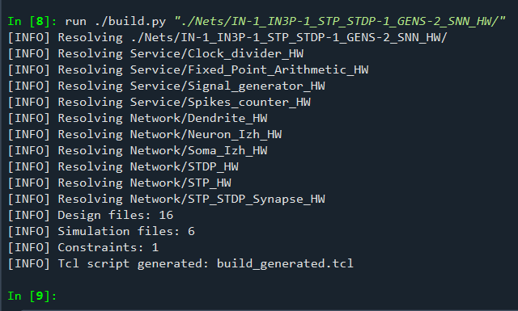
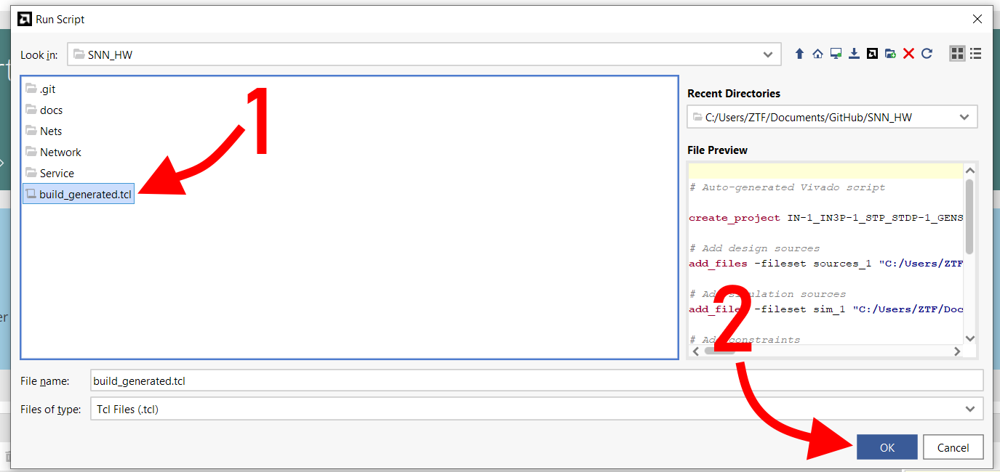
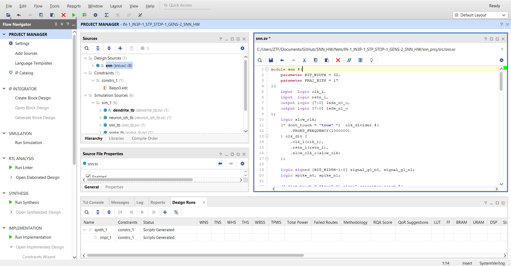

# How to build Vivado project

## Generate build_generated.tcl script

Use build.py script in the root of repository. The resulting `build_generated.tcl` script will be created in the root of repository.

```bash
./buid.py "<module_type>/<module_name>"
```

### Example

Run `build.py` script using Spyder:



## Run build_generated.tcl script in Vivado




## Enjoy



## Notes

- If the Vivado project wasn't saved, you can find temp project copy in the `C:\Users\<user_name>\AppData\Roaming\Xilinx\Vivado` directory.
